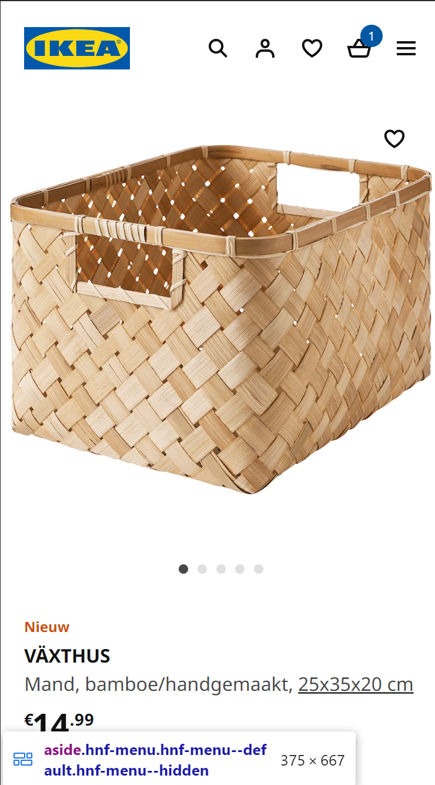
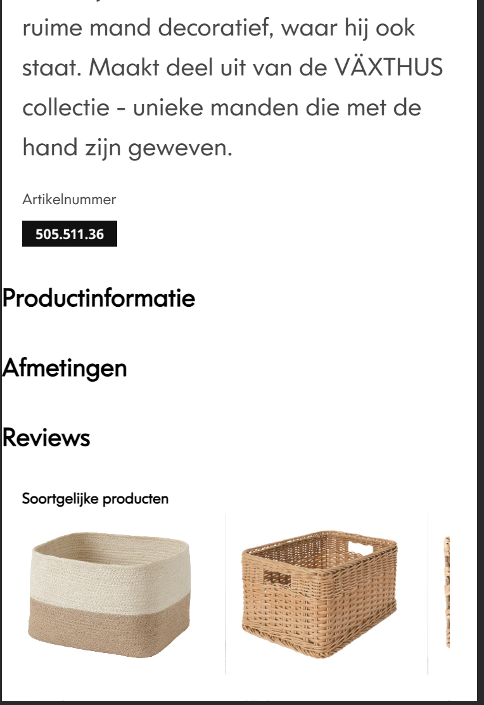
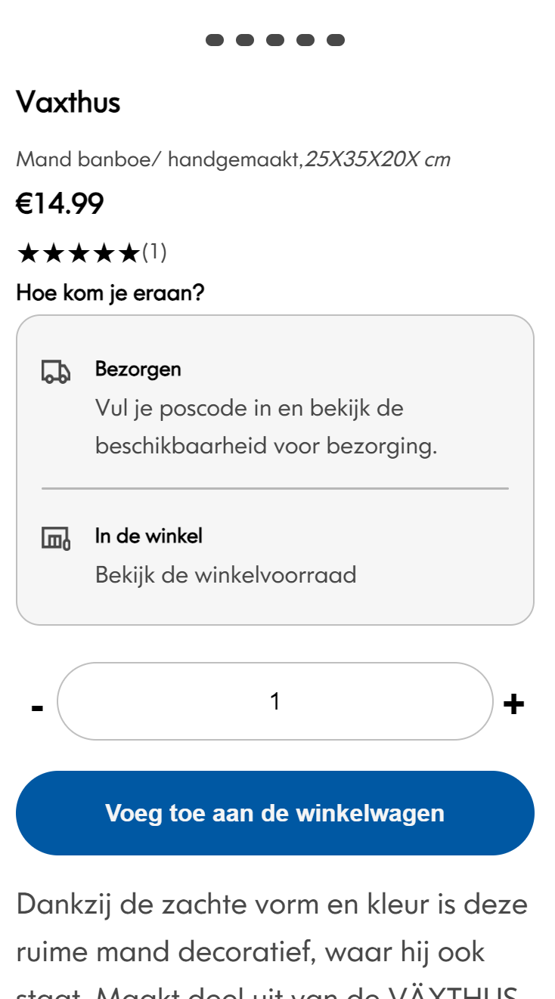

# Procesverslag
Markdown is een simpele manier om HTML te schrijven.  
Markdown cheat cheet: [Hulp bij het schrijven van Markdown](https://github.com/adam-p/markdown-here/wiki/Markdown-Cheatsheet).

Nb. De standaardstructuur en de spartaanse opmaak van de README.md zijn helemaal prima. Het gaat om de inhoud van je procesverslag. Besteedt de tijd voor pracht en praal aan je website.

Nb. Door *open* toe te voegen aan een *details* element kun je deze standaard open zetten. Fijn om dat steeds voor de relevante stuk(ken) te doen.

## Jij

  
uitwerken voor kick-off werkgroep

  ### Auteur:
  Michelle Witlox

  #### Je startniveau:
  Rood

  #### Je focus:
  Weet ik nog niet
 

## Je website

  
uitwerken voor kick-off werkgroep

  ### Je opdracht:
  link naar de website die je gaat namaken óf de naam/omschrijving van je eigen ontwerp
  https://www.ikea.com/nl/nl/
  #### Screenshot(s) van de eerste pagina (small screen): 
  hier de naam van de pagina  
  

  #### Screenshot(s) van de tweede pagina (small screen):
  hier de naam van de pagina  
  
 

## Toegankelijkheidstest 1/2 (week 1)

  
uitwerken na test in 2e werkgroep

  ### Bevindingen
  Lijst met je bevindingen die in de test naar voren kwamen:
  - buttons zeggen niet wat ze doen
  - introductie wanneer je op pagina komt
  - fotos hebben geen omschrijving die logisxh kan zijn voor gebruikers, alleen logisch voor programeur.
  - titels worden niet opgelezen 
  vrij onmogelijk voor mensen met een zicht beperking om de website te gebruiken 

## Breakdownschets (week 1)

  
uitwerken na afloop 3e werkgroep

  ### de hele pagina: 
  

## Voortgang 1 (week 2)

   Na de beoordelingsgesprekken heb ik ervoor gekozen om een andere site te gaan programeren, waar ik dacht dat ik de 
    vorige site niet in een screenreader vriendelijke manier had gecodeerd en ik geen zin had om weer opnieuw te beginnen aan de 
    zelfde site. daarom heb ik de site van ikea nu na gemaakt. 

    ik was hier mee begonnen in de kerst vakantie maar heb toen geen fotos gemaakt van de home pagina die ik ging namaken. daarom
    ziet de pagina er nu iets anders uit maar het hoofd idee blijft het zelfde.

    deze week ben ik begonnen met het maken van de sliders en de footer. bij de sliders liep ik tegen het probleem aan dat deze buiten 
    de breedte van de body vielen. hierdoor werd de positionering van alle andere elementen ook niet meer goed.
    bij de footer had ik juist het probleem dat de achtergrond van de footer niet over de hele breedte van de body liep terwijl dit
    wel zou moeten. dit kwam omdat ik een margin op de body had gezet. hierdoor heb ik uiteindelijk dus de margin van de body naar de header en 
    main verplaatst 

    toen ik toen aankwam bij pagina 2 liep ik er tegen aan dat de fotos in een section van de main wel weer over de hele scherm breedte moeste
    lopen. hierdoor heb ik bij pagina 2 de margin op de header en specifieke sections gezet om dit op te lossen. 

    om de carousel te maken had ik bij mijn eerste website met mijn broer gezeten, mijn broer had mij uitleg gegeven over hoe ik dit kon doen.
    omdat het  principe van de carousel die ik nodig had in deze pagina precies hetzelfde was heb ik deze code hergebruikt , en alleen de aantal fotos
    en knoppen aangepast en de src van de fotos. 
    
  
  

## Voortgang 2 (week 3)

  
uitwerken voor 2e voortgang

  hier ben ik begonnen met het maken van de input die je kan op en aftellen met nummer. ik had dit nog nooit gedaan 
  dus wist eerst niet supper goed hoe ik dit moest aanpakken uiteindelijk had ik besloten om met het zelfde soort systeem 
  te werken als dat ik bij de carousel gebruikt had. hiermee bedoel ik met index waardes. ik heb hierdoor uiteindelijk wevoor gezorgt
  dat wanneer de eerste button word ingedrukt [0] dit gelijk staat aan het aftrekken van 1 en wanneer button twee [1] word ingedrukt
  dat er een word bijgeteld. 

  daarnaast  was ik begonnen met het maken van de pop up buttons. het was hierbij belangrijk dat er maar een van de 3 pop ups tegerlijkertijd
  open konden staan en dat de positioneren van de buttons als wel de pop up containers juist waren. 
  Ik had hierbij het meeste moeite met het tweede omdat ik graag wou dat de buttons op de juiste plek stonden voor meerdere telefoon grootes. 
  uiteindelijk is het best goed gelukt maar ben ik nog steeds niet helemaal tevreden
   
  
  in de foto hier boven is te zien hoe mijn uiteindelijke resultaat is geworden. 
  het enige wat hierbij niet gelukt is is wanneer de button active is er een extra dot in de button komt

## Toegankelijkheidstest 2/2 (week 4)

  
uitwerken na test in 9e werkgroep

  ### Bevindingen
  Lijst met je bevindingen die in de test naar voren kwamen (geef ook aan wat er verbeterd is):
  - fotos hebben een passende alt
  - heading worden niet opgelezen  hierdoor blijft het vrijwel onmogelijk om door de pagina heen te gaan met een screenreader

## Voortgang 3 (week 4)
in week 4 moest ik eigenlijk alleen nog de puntjes op de i krijgen. ik heb hierbij lang geprobeerd om mijn screenreader de headings 
op te laten lezen maar dit is uiteindelijk nog steeds niet het geval. hoewel ik wel denk dat mijn code op de juiste manier geschreven is 
om dit te moeten doen. 

ik heb in week 4 nog de kleuren aan gepast nar var kleuren 

  

 
  

  

## Eindgesprek (week 5)

  
uitwerken voor eindgesprek

  ### Je uitkomst - karakteristiek screenshots:
  

  ### Dit ging goed/Heb ik geleerd: 
  Korte omschrijving met plaatjes

  ik heb geleerd om met index nummers te werken. en hierdoor een op en aftel input te maken 

  

  ### Dit was lastig/Is niet gelukt:
  Korte omschrijving met plaatjes

  
  het is uiteindelijk niet gelukt om de active state in de button toe te voegen. 
  en bij de carousel is dit ook niet gelukt hier veranderd de kleur alleen wanneer je op de button klikt 

## Bronnenlijst

  
continu bijhouden terwijl je werkt

  Nb. Wees specifiek ('css-tricks' als bron is bijv. niet specifiek genoeg). 
  Nb. ChatGpT en andere AI horen er ook bij.
  Nb. Vermeld de bronnen ook in je code.

  1. https://www.ikea.com/nl/nl/
  2. https://chat.openai.com/c/479bea02-9316-4929-8124-8f21a96f4e3f
  3. hulp broer
  4.  https://www.youtube.com/watch?v=sQUB039MG0I&t=38s 
  5. https://fontswan.com/ikea-font/
  6. https://chat.openai.com/c/ed29a705-cec3-46fb-a21f-15b470288b3a

